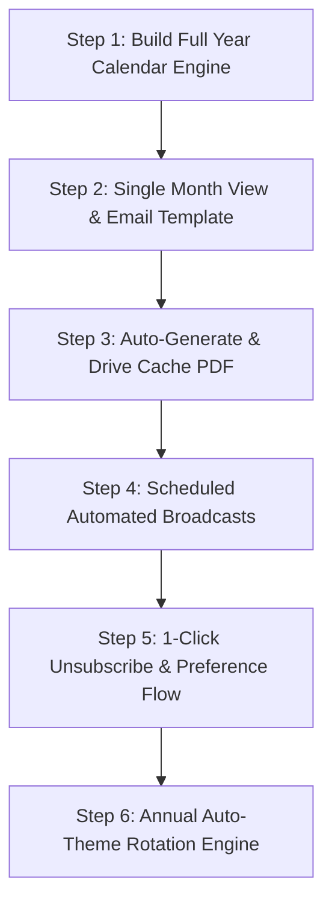

# Tendler Family Tree & Birthday Engine — Project Roadmap

A comprehensive, interactive genealogy platform and automated Jewish/Secular calendar generation system for the extended Tendler family.

---

## 🎯 Architecture & Next Phase Objectives

The next phase expands the platform beyond an interactive tree into an **automated family engagement and calendar delivery system**. This encompasses automated weekly/monthly email newsletters, custom high-resolution printable calendars (PDF/A4/Letter), intelligent unsubscribe flows, and Google Drive-backed dynamic caching.

```
┌────────────────────────────────────────────────────────────────────────┐
│                        Tendler Family Engine                           │
│                                                                        │
│   ┌───────────────────────┐          ┌─────────────────────────────┐   │
│   │   Interactive Tree    │          │    Dynamic Calendar Engine  │   │
│   │   & Live Modals (UI)  │          │  (1-Month Web & Full Year)  │   │
│   └───────────┬───────────┘          └──────────────┬──────────────┘   │
│               │                                     │                  │
│   ┌───────────▼───────────┐          ┌──────────────▼──────────────┐   │
│   │  Google Apps Script   │◄─────────┤   Automated Email Service   │   │
│   │  (Doc & Sheet Sync)   │          │  (Weekly Digest & Monthly)  │   │
│   └───────────────────────┘          └─────────────────────────────┘   │
└────────────────────────────────────────────────────────────────────────┘
```

---

## 📅 Roadmap Breakdown: Dynamic Printable Calendar System

### Task 1: Generate Full-Year Printable Calendar (Top Priority)
> **Goal**: Build the core rendering engine that compiles all family birthdays, Jewish holidays, and secular holidays into a high-resolution, print-ready 12-month calendar (PDF / Print layout).

- [ ] **Dual-Date Grid Algorithm (Hebrew & Gregorian in Every Cell)**:
  - Exact Gregorian calendar matrix (Jan–Dec or Jewish Year Tishrei–Elul).
  - Synchronized Hebrew dates in every day cell with Jewish leap-year support (Adar I / Adar II).
- [ ] **Multi-Layered Event Compilation**:
  - 🎂 **Hebrew Birthdays** (Gold/Amber accent badge).
  - 🎂 **English Birthdays** (Emerald/Blue accent badge).
  - ✡️ **Jewish Holidays & Fast Days** (Rosh Hashana, Yom Kippur, Sukkot, Chanukah, Purim, Pesach, Shavuot, Rosh Chodesh, etc.).
  - 🇺🇸 **US Federal Holidays** (Thanksgiving, July 4th, Memorial Day, Labor Day, etc.).
  - 🇮🇱 **Israeli National Holidays** (Yom HaZikaron, Yom HaAtzmaut, Yom Yerushalayim).
- [ ] **Print-Ready Landscape Layout & Visual Key**:
  - Formatted for standard Letter/A4 horizontal printing (`@media print` and high-DPI vector rendering).
  - Clean page-break per month with prominent title, mini previous/next month thumbnails, and visual legend key.
  - Matches the premium royal navy & gold theme of the family tree portal.

---

### Task 2: Monthly Page View & Email-Friendly Inline Version
> **Goal**: Generate a single-month view accessible both as an interactive webpage and as a standalone inline HTML format for email distribution.

- [ ] **Single-Month Interactive Web Viewer**:
  - Month switcher (prev/next month, jump to current month).
  - Quick-filter toggles (Hebrew birthdays only, English birthdays only, Holidays only).
  - Direct "Print This Month" button.
- [ ] **Email-Friendly Inline HTML Template**:
  - Clean table-based responsive HTML/CSS (compatible with Gmail, Apple Mail, Outlook).
  - Renders the month's grid or a curated weekly agenda view with clickable member details.

---

### Task 3: Automatic Background Generation & Google Drive Caching
> **Goal**: Automatically build and cache the 12-month PDF in Google Drive, regenerating dynamically whenever data changes.

- [ ] **Google Drive Storage & Caching**:
  - Apps Script backend generates the PDF blob and persists it to a designated Google Drive folder as `Tendler_Family_Calendar_<Year>.pdf`.
  - Serves direct download links to users without recomputing each time.
- [ ] **Dynamic Cache Invalidation**:
  - When a new member or birthday is added via the UI/sheet, the script triggers an automatic background rebuild to keep the cached PDF 100% up-to-date.
- [ ] **On-Demand "Email Me My PDF" Action**:
  - Users can click one button on the site or in an email to receive the freshly generated calendar attached to their inbox.

---

### Task 4: Automated Scheduled Broadcasts (Weekly, Monthly, Jan 1st / Rosh Hashana)
> **Goal**: Set up hands-off automated delivery pipelines across the family.

- [ ] **Annual Master Blast (Jan 1st & Rosh Hashana)**:
  - Automated cron that emails the full-year printable calendar PDF to **all family members** across the master contact list (`Contacts` + `Birthdays` tabs).
- [ ] **1st-of-the-Month Overview**:
  - Monthly blast containing the upcoming month's calendar page, milestone birthdays, and PDF download link.
- [ ] **Weekly Birthday Reminder Digest**:
  - Weekly email summarizing birthdays in the upcoming 7–10 days.
  - Subscription management via `Birthdays` sheet columns: `Email` and `Subscribe (Yes/No)`.

---

### Task 5: 1-Click Unsubscribe & Profile Self-Service
> **Goal**: Frictionless opt-out and profile editing.

- [ ] **1-Click Unsubscribe Link in Footers**:
  - Hyperlink with token/parameter that automatically flips the member's status from `Yes` to `No` in the sheet without login.
- [ ] **Disclaimer & Direct Edit Links**:
  - Footers linking directly to the Google Doc & Sheet for manual profile adjustments.

---

### Task 6: Annual Automated Theme Rotation Engine (10 Designer Presets)
> **Goal**: Keep the website and calendar visuals fresh every year automatically.

- [ ] **Curated Theme Presets**: ~10 pre-approved luxury color palettes and typographic styles.
- [ ] **Synchronized Web & PDF Styling**: The calendar engine inherits color tokens directly from the active annual theme.
- [ ] **Automated Annual Switcher**: Rotates on schedule (e.g. annually on Rosh Hashana / Jan 1st) with admin manual override.

---

## 🚀 Step-by-Step Implementation Sequence



| Phase | Milestone | Focus | Deliverable | Status |
|---|---|---|---|---|
| **Phase 1** | **Core Tree & Live Modals** | Frontend | Interactive tree, search, contact cards, 7-day upcoming popup, inline birthday cakes | ✅ Complete |
| **Phase 2** | **Backend Read/Write Integration** | Google Apps Script | Apps Script Web App, Google Doc bullet sync, dynamic sheet row insertion | ✅ Complete |
| **Phase 3.1** | **[1] Full-Year Calendar Engine** | Engine / PDF | Printable 12-month dual Gregorian/Hebrew grid with all birthdays and 3-tier holidays | 🟡 **Starting Now** |
| **Phase 3.2** | **[2] Monthly Page & Email Version** | Web & Email HTML | Interactive single-month web viewer + responsive table-based email template | ⏳ Next |
| **Phase 3.3** | **[3] Auto-Generate & Cache** | Backend / Drive | Apps Script background PDF generation & Google Drive caching | ⏳ Next |
| **Phase 3.4** | **[4] Automated Delivery (Jan 1 / Rosh)** | Scheduled Triggers | Master annual calendar broadcast & weekly birthday digest | ⏳ Next |
| **Phase 4** | **1-Click Unsubscribe & Self-Service** | Backend / Endpoints | Footer 1-click `Yes`→`No` toggle & disclaimer links | ⏳ Scheduled |
| **Phase 5** | **Annual Theme Rotation Engine** | Design System | 10 pre-approved designer palettes auto-cycling annually | ⏳ Final Phase |
